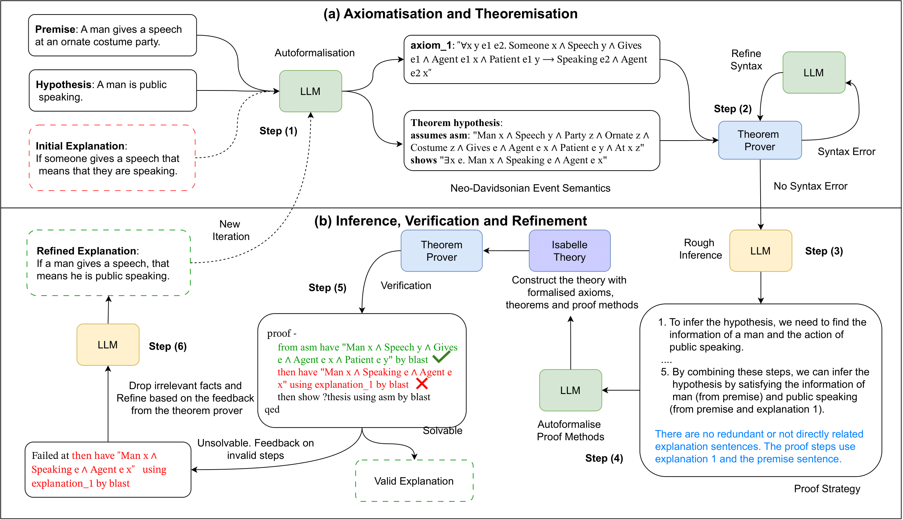

# Verification and Refinement of Natural Language Explanations through LLM-Symbolic Theorem Proving
Natural language explanations represent a proxy for evaluating explanation-based and multi-step Natural Language Inference (NLI) models. However, assessing the validity of explanations for NLI is challenging as it typically involves the crowd-sourcing of apposite datasets, a process that is time-consuming and prone to logical errors. To address existing limitations, this paper investigates the verification and refinement of natural language explanations through the integration of Large Language Models (LLMs) and Theorem Provers (TPs). Specifically, we present a neuro-symbolic framework, named Explanation-Refiner, that integrates TPs with LLMs to generate and formalise explanatory sentences and suggest potential inference strategies for NLI. In turn, the TP is employed to provide formal guarantees on the logical validity of the explanations and to generate feedback for subsequent improvements. We demonstrate how Explanation-Refiner can be jointly used to evaluate explanatory reasoning, autoformalisation, and error correction mechanisms of state-of-the-art LLMs as well as to automatically enhance the quality of explanations of variable complexity in different domains.



### Install Dependencies

#### Python Libraries

To install all the required Python libraries for this project, execute the following command:

```bash
pip install -r requirements.txt
```

### Isabelle

#### Linux Installation:

Download Isabelle2023 in your working directory (e.g., Desktop):

```bash
wget https://isabelle.in.tum.de/website-Isabelle2023/dist/Isabelle2023_linux.tar.gz
tar -xzf Isabelle2023_linux.tar.gz --no-same-owner
```

Append Isabelle2023's bin directory to your PATH
```bash
export PATH=$PATH:/Users/user/Desktop/Isabelle2023/bin 
```

#### macOS Installation:

Download Isabelle2023/2024 for macOS from the official website: https://isabelle.in.tum.de/

Append Isabelle2023's bin directory to your PATH
```bash
export PATH=$PATH:/Users/user/Desktop/Isabelle2023.app/bin
```

#### API Keys
Set your `api_key` in the `config.yaml` file. This project also supports using Ollama with any open-weight or open-source LLMs.

###  Reproducibility
Clone this repository into the same directory where you installed Isabelle. Run the following command:

```bash
python main.py --model <model_name> --data <dataset_name> --max_iterations <number_of_iterations>
```

#### Example Usage:
To run the model gpt-4o on the example dataset with the default number of iterations:

```bash
python main.py --model gpt-4o --data example
```

#
We also have an integrated version with lastest updates at [repository](https://github.com/neuro-symbolic-ai/reasoning_with_nle_emnlp_2024/tree/main) with [running examples](https://github.com/neuro-symbolic-ai/reasoning_with_nle_emnlp_2024/blob/main/Neuro-Symbolic%20Explanation%20Refinement.ipynb).

#
If you find this repository useful, please consider citing our paper.
```
@inproceedings{quan-etal-2024-verification,
    title = "Verification and Refinement of Natural Language Explanations through {LLM}-Symbolic Theorem Proving",
    author = "Quan, Xin  and
      Valentino, Marco  and
      Dennis, Louise A.  and
      Freitas, Andre",
    editor = "Al-Onaizan, Yaser  and
      Bansal, Mohit  and
      Chen, Yun-Nung",
    booktitle = "Proceedings of the 2024 Conference on Empirical Methods in Natural Language Processing",
    month = nov,
    year = "2024",
    address = "Miami, Florida, USA",
    publisher = "Association for Computational Linguistics",
    url = "https://aclanthology.org/2024.emnlp-main.172",
    pages = "2933--2958",
    abstract = "Natural language explanations represent a proxy for evaluating explanation-based and multi-step Natural Language Inference (NLI) models. However, assessing the validity of explanations for NLI is challenging as it typically involves the crowd-sourcing of apposite datasets, a process that is time-consuming and prone to logical errors. To address existing limitations, this paper investigates the verification and refinement of natural language explanations through the integration of Large Language Models (LLMs) and Theorem Provers (TPs). Specifically, we present a neuro-symbolic framework, named Explanation-Refiner, that integrates TPs with LLMs to generate and formalise explanatory sentences and suggest potential inference strategies for NLI. In turn, the TP is employed to provide formal guarantees on the logical validity of the explanations and to generate feedback for subsequent improvements. We demonstrate how Explanation-Refiner can be jointly used to evaluate explanatory reasoning, autoformalisation, and error correction mechanisms of state-of-the-art LLMs as well as to automatically enhance the quality of explanations of variable complexity in different domains.",
}

```

